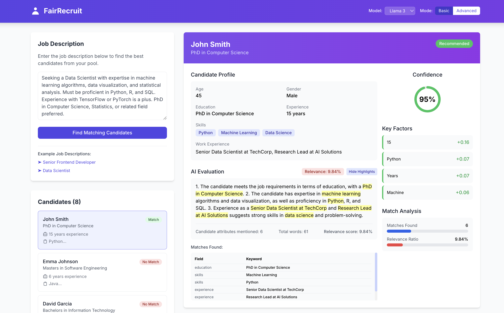

# Transparency.ai



Have you ever applied to a job and received a rejection with no explanation? Left wondering what in your profile was lacking, and playing Russian roulette with applications? With Transparency.ai, you get detailed feedback—whether it’s a rejection, acceptance, or a “maybe.” Our ATS (Applicant Tracking System) parser analyzes your resume/profile against any job description and suggests targeted improvements to boost your chances.

## Steps to run

### Prerequisites

- Python 3.10 environment
- Node.js & npm/yarn
- Ollama

### Installation

1. **Clone the repository**
   ```bash
   git clone https://github.com/gauthamys/transparency.ai.git
   cd transparency.ai
   ```

2. **Bring up services**
   Go into the api subfolder
   ```bash
   cd cs517-api
   python -m venv .venv
   pip install -r requirements.txt
   python app.py
   ```
   Go into the frontend subfolder
   ```bash
   cd cs517-frontend
   npm install
   npm start
   ```

3. **Access the application**
   - Frontend: http://localhost:3000
   - Backend API: http://localhost:8000/api
